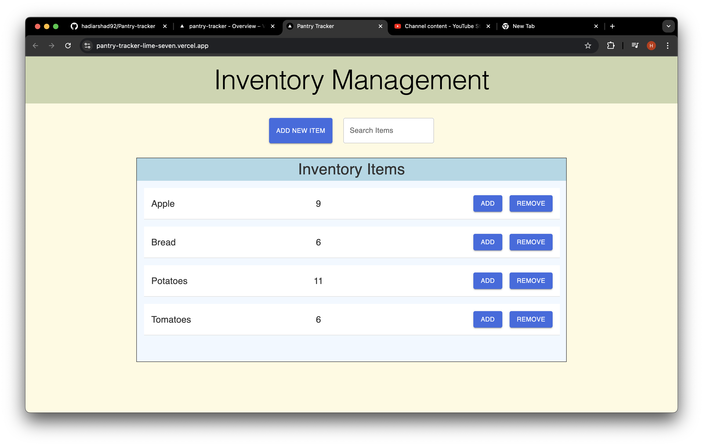

# Pantry-tracker

live Demo: https://pantry-tracker-iota-red.vercel.app/


Pantry Tracker is a web application designed to manage inventory efficiently. Built with Next.js and Material-UI, this application allows you to add new items, set their quantities, and manage existing inventory by increasing or decreasing the quantities. The application also integrates Firebase for data storage.

## Features

- **Add New Items:** Easily add new items to your inventory with specified quantities.
- **Update Item Quantities:** Increase or decrease the quantity of existing items in your inventory.
- **Search Functionality:** Quickly find items in your inventory using the search bar.
- **Responsive Design:** Built with Material-UI for a clean and responsive user interface.

## Technologies Used

- **Next.js:** A React framework for server-side rendering and building static web applications.
- **Material-UI:** A popular React UI framework for designing clean and modern interfaces.
- **Firebase:** Used for real-time database and storage.


## Color Scheme
The application uses a soothing and visually appealing color palette:

- Background: #CCD5AE
- Headers: #E0E5B6
- Buttons: #FAEDCE
- Modal Background: #FEFAE0
- Item and Quantity Background: White (#FFFFFF)


## Installation

1. Clone the repository:
   ```bash
   git clone https://github.com/your-username/pantry-tracker.git
   ```
2. Navigate to the project directory:
   ```bash
   cd pantry-tracker
   ```
3. Install dependencies:
   ```bash
   npm install
   ```
4. Set up Firebase:

   - Create a Firebase project in the Firebase console.
   - Set up Firestore and obtain your Firebase configuration.
   - Create a `firebase.js` file in the project root and add your Firebase configuration.

5. Start the development server:
   ```bash
   npm run dev
   ```

## Usage

- Open the application in your browser at `http://localhost:3000`.
- Use the "Add New Item" button to add items to your inventory.
- Use the search bar to find specific items quickly.
- Click the "Add" or "Remove" buttons to update item quantities.

## Screenshots


_Home Screen of Pantry Tracker._

## Contributing

Contributions are welcome! Please fork the repository and create a pull request with your changes.
